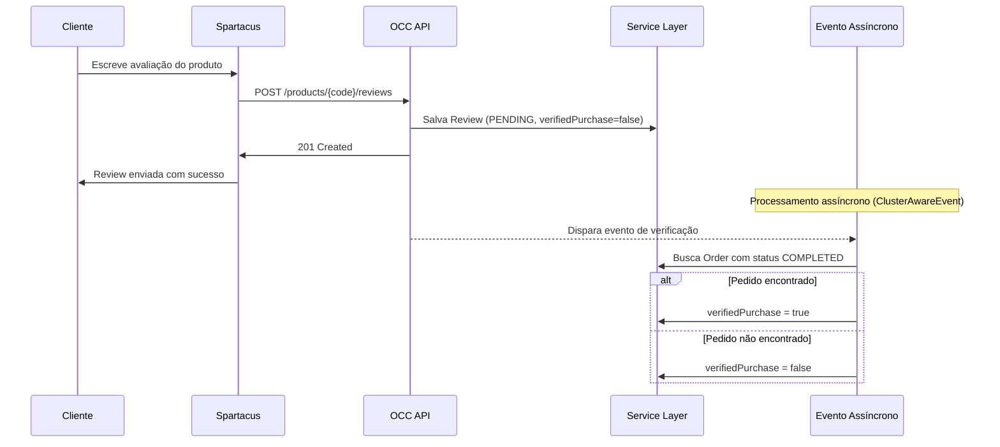
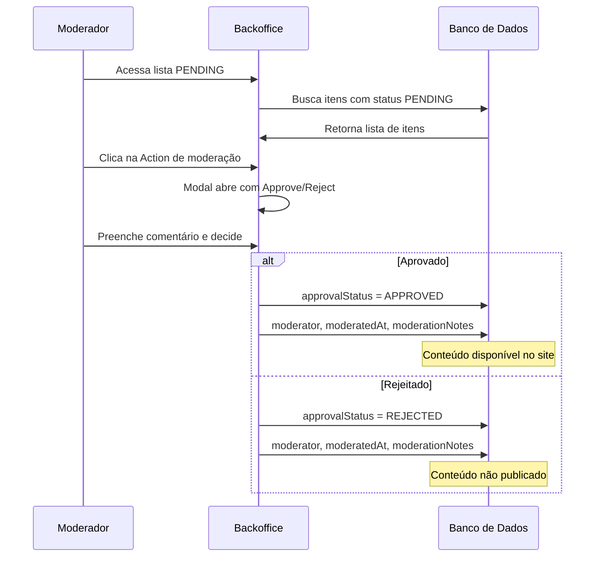

## Telefônica POC | Perguntas e Repostas do Produto e Customer Review

> POC desenvolvida sobre SAP Commerce 2211 (B2C Telco) para gerenciar
> avaliações de produtos, perguntas e respostas com fluxo completo de
> moderação e api para sumário de engajamento.

---

## Índice

- [Requisitos Mínimos Para Setup](#-requisitos-mínimos-para-setup)
- [Instalação e Configuração](#️-instalação-e-configuração)
- [Instruções de Execução](#instruções-de-execução)
- [Arquitetura](#️-arquitetura)
- [Endpoints](#endpoints)
- [Arquivos ImpEx](#arquivos-impex)
- [Backoffice Funcional](#backoffice-funcional)
- [Relatório de Cobertura de Testes](#-relatório-de-cobertura-de-testes)
- [Contribuidores](#-contribuidores)

---

## Requisitos Mínimos Para Setup

| Ferramenta | Versão |
|---|---|
| SAP Commerce Cloud | 2211.44 |
| SAP Commerce Telco | 2302.6 |
| Java | 17 (SapMachine recomendado) |
| Git | Qualquer versão recente |
| RAM | Mínimo 8GB (recomendado 16GB) |
| Disco | Mínimo 20GB livres |

---

## Instalação e Configuração

### 1. Clonar o repositório na sua pasta desejada, nesse caso será o root no linux
```bash
cd ~
git clone git@github.com:andrei-discover/telefonica-poc.git
cd telefonica-poc
```

### 2. Baixar e extrair os pacotes SAP Commerce
Baixe o arquivo `telco-accelerator.zip` através do link abaixo e extraia na estrutura do projeto:
> [Download telco-accelerator.zip](https://discover2-my.sharepoint.com/:u:/g/personal/andrei_nalevaiko_discover_com_br/IQDpk-C1Vu4XSoqsDvQ3cam8AaYHPCsbP_S6XZ3xx0nCgxw?e=9NWWFe)
```bash
cd ~/Downloads
unzip telco-accelerator.zip
cd telco-accelerator
mv modules ~/telefonica-poc/core-customize/hybris/bin/
mv platform ~/telefonica-poc/core-customize/hybris/bin/
```

### 3. Backup da configuração atual
```bash
cd telefonica-poc/core-customize/hybris/bin
mv config config_old
```

### 4. Build inicial
```bash
cd core-customize/hybris/bin/platform
. ./setantenv.sh
ant
```

> Durante o processo do `ant`, pressione **ENTER** para confirmar
> o ambiente padrão de desenvolvimento.

### 5. Restaurar configurações customizadas
```bash
cd telefonica-poc/core-customize/hybris/bin
cp -R config_old/* ../../config/
```

### 6. Build completo e inicialização do banco
```bash
ant clean all
ant initialize
```

> O `ant initialize` já importa todos os dados necessários,
> incluindo grupos, usuários e produtos de exemplo.

### 7. Inicialização do servidor

Após o build completo, inicie o servidor SAP Commerce:
```bash
cd ~/telefonica-poc/core-customize/hybris/bin/platform
./hybrisserver.sh
```

O servidor utiliza o banco de dados **HSQL** pré configurado do SAP Commerce, não sendo necessária nenhuma configuração adicional de banco de dados.

> Aguarde até que a mensagem abaixo apareça no console antes de acessar o sistema:
> ```
> Server startup in XXXX ms
> ```

---

### 8. Instalação e Execução do Spartacus (Frontend)

#### Pré-requisitos

| Ferramenta | Versão |
|---|---|
| Angular CLI | 19+ |
| Node.js | 22.0.0+ |
| npm | 10.5.1+ |

#### Instalação
```bash
cd ~/telefonica-poc/js-storefront/telco-spartacus
yarn install
```

#### Execução
```bash
yarn start
```

Certifique-se de que o servidor SAP Commerce está rodando antes de iniciar o Spartacus.

#### Acessar o Spartacus
Após o servidor iniciar, acesse:
```
http://localhost:4200/
```

> Aguarde até que a mensagem abaixo apareça no console antes de acessar:
> ```
> ✔ Compiled successfully.
> ```

---

## Instruções de Execução

### 1. Validar o ambiente localmente

| Ferramenta | URL |
|---|---|
| Backoffice | https://localhost:9002/backoffice |
| HAC | https://localhost:9002/hac |
| Swagger | https://localhost:9002/occ/v2/swagger-ui/index.html |

### 2. Credenciais de teste locais, com acesso ao Spartacus e Backoffice

| Usuário | Senha | Papel |
|---|---|---|
| `admin` | `nimda` | Administrador |
| `moderator@telcospa.com` | `1234` | Moderador Backoffice |
| `kyle.troop@hybris.com` | `1234` | Cliente |
| `john.lucas@hybris.com` | `1234` | Cliente |
| `selfserviceuser5@hybris.com` | `1234` | Cliente |

---

## Arquitetura

### Extensões customizadas

| Extensão | Responsabilidade |
|---|---|
| `telefonicacore` | Models, Services e DAOs |
| `telefonicafacades` | Facades e Data Objects |
| `telefonicaocc` | Controllers OCC e DTOs |
| `telefonicabackoffice` | Actions, Controllers ZK e Widgets |

### Verificação de Compra Verificada com evento assíncrono

> Quando um cliente cria uma avaliação, um evento assíncrono é disparado automaticamente
> pelo SAP Commerce utilizando a interface `ClusterAwareEvent`. Esse evento busca em segundo
> plano um pedido com status `COMPLETED` do cliente para o produto avaliado.
> Se encontrado, a avaliação é marcada como `verifiedPurchase = true`, indicando que o
> cliente realmente comprou o produto antes de avaliar.
> Essa abordagem garante que a criação da review não seja bloqueada pelo processo de
> verificação, mantendo a performance e funcionando corretamente em ambiente de cluster.


### Fluxo de Moderação no Backoffice

> O moderador acessa o Backoffice e filtra o conteúdo pendente de moderação.
> Após analisar o conteúdo, aprova ou rejeita com um comentário obrigatório.
> Todos os dados de auditoria são persistidos automaticamente.
> Após aprovação o conteúdo fica disponível para exibição no site.


### Decisões Arquiteturais

**1. Separação em extensões seguindo padrão SAP Commerce**
O projeto foi estruturado em quatro extensões customizadas seguindo o padrão SAP Commerce,
cada uma com responsabilidade clara: `telefonicacore` para models, services e DAOs,
`telefonicafacades` para facades e data objects, `telefonicaocc` para controllers OCC e DTOs
e `telefonicabackoffice` para actions, controllers ZK e widgets.

**2. Utilização das camadas de Service Layer do SAP Commerce**
Seguimos rigorosamente o padrão de camadas do SAP Commerce onde o DAO é responsável apenas
por queries via FlexibleSearchService, o Service pela lógica de negócio, a Facade por
orquestrar as chamadas e converter os objetos e o Controller por receber e retornar DTOs.
Essa separação garante testabilidade e alinhamento com o padrão SAP Commerce.

**3. Extensão do CustomerReview nativo do SAP Commerce**
Em vez de criar um novo tipo, optamos por estender o CustomerReview nativo adicionando apenas
os atributos necessários: moderator, moderatedAt, moderationNotes, verifiedPurchase e
helpfulVotes. Essa decisão reduz complexidade e aproveita toda a infraestrutura nativa
do SAP Commerce.

**4. Evento assíncrono para verificação de compra**
Criamos um evento assíncrono implementando a interface ClusterAwareEvent do SAP Commerce.
Quando uma review é criada o evento é disparado e busca assincronamente um pedido com
status COMPLETED do usuário para o produto avaliado. Se encontrado, marca a review como
verifiedPurchase. Essa abordagem não bloqueia a criação da review e funciona em ambiente
de cluster.

**5. CustomerReviewVote como tabela separada**
O controle de votos foi implementado como uma tabela separada em vez de apenas um contador
no CustomerReview. Essa decisão garante o controle de um voto por usuário por review,
rastreabilidade completa de quem votou e quando e integridade dos dados pelo serviço.

**6. Sumário de engajamento calculado em memória**
Para o endpoint de engajamento optamos por buscar os dados via FlexibleSearchService uma
única vez e realizar os cálculos em memória no Service. Essa decisão separa as
responsabilidades entre DAO e Service, facilita os testes unitários e torna os cálculos
mais fáceis de evoluir.

---

## Endpoints

### Swagger
```
https://localhost:9002/occ/v2/swagger-ui/index.html
```

### Endpoints customizados

#### Customer Review
| Método | Endpoint | Descrição | Autenticação |
|---|---|---|---|
| `POST` | `/{baseSiteId}/products/{productCode}/reviews` | Cria uma avaliação de produto | `ROLE_CUSTOMERGROUP` |

#### Review Vote
| Método | Endpoint | Descrição | Autenticação |
|---|---|---|---|
| `POST` | `/{baseSiteId}/reviews/{reviewPk}/vote` | Vota em uma avaliação como útil | `ROLE_CUSTOMERGROUP` |

#### Perguntas e Respostas do Produto
| Método | Endpoint | Descrição | Autenticação |
|---|---|---|---|
| `POST` | `/{baseSiteId}/productquestions` | Cria uma pergunta sobre um produto | `ROLE_CUSTOMERGROUP` |
| `GET` | `/{baseSiteId}/productquestions?productCode={code}` | Lista perguntas aprovadas de um produto | Público |

#### API para Engajamento do Produto
| Método | Endpoint | Descrição | Autenticação |
|---|---|---|---|
| `GET` | `/{baseSiteId}/products/{productCode}/engagement-summary?topN={n}` | Retorna sumário de engajamento do produto | `ROLE_CUSTOMERGROUP` |

---

## Arquivos ImpEx

### Estrutura
```
telefonicacore/import/poc/
  ├── impex/
  │   ├── telefonica-review-qa-data.impex      → Dados de exemplo (reviews, perguntas, moderação)
  └── groovy/
      └── groovy_votes.groovy                  → Votos nas reviews
```

### Descrição dos arquivos

#### `telefonica-pdp-question-tab.impex`
Cria o grupo de moderação, o usuário moderador e configura as permissões de acesso
restritas ao Backoffice para `CustomerReview` e `ProductQuestion`.

#### `telefonica-review-qa-data.impex`
Dados de exemplo para os três produtos de teste:

| Produto | Reviews Aprovadas | Reviews Rejeitadas | Reviews Pending | Perguntas Aprovadas | Perguntas Pending |
|---|---|---|---|---|---|
| `iPhone_13_blue_256g` | 5 | 1 | 2 | 3 | 2 |
| `iPhone_13_Pro_Max_alpinegreen_1024g` | 3 | 0 | 1 | 2 | 1 |
| `mibox_4g` | 0 | 0 | 1 | 0 | 1 |

#### `groovy_votes.groovy`
Script Groovy para registrar votos nas reviews aprovadas via HAC Scripting.

### Como importar

**ImpEx via HAC:**
```
1. Acesse https://localhost:9002/hac/impex/import
2. Importe na ordem:
   1º telefonica-pdp-question-tab.impex
   2º telefonica-review-qa-data.impex
```

**Groovy via HAC:**
```
1. Acesse https://localhost:9002/hac/console/scripting
2. Selecione Language: Groovy
3. Selecione Commit mode: Commit
4. Cole o conteúdo do arquivo groovy_votes.groovy
5. Clique em Execute
```

---

## Backoffice Funcional

### Customer Review

**1. Menu Telefonica**

> Após login com `moderator@telcospa.com`, acesse o menu **Telefonica** no painel lateral.
> O menu possui três submenus:
> - Perguntas sobre Produtos
> - Revisão do Cliente
> - Voto de Avaliação do Cliente


---

**2. Filtrando Reviews Pendentes**

> Acesse **Revisão do Cliente** e aplique o filtro:
> - Clique na 🔍 lupa para abrir os filtros
> - Selecione **Status de Aprovação** igual a **Pendente**
> - Clique em **Pesquisar**


---

**3. Dados do Customer Review**

> Clique em uma review para visualizar todos os atributos disponíveis.
> Destaque para o atributo **cloud** que permite acionar a moderação.


---

**4. Modal de Moderação**

> Clique no botão de moderação para abrir a modal.
> Preencha o comentário e clique em **Aprovar** ou **Rejeitar**.


---

**5. Dados de Auditoria após Aprovação**

> Após clicar em **Aprovar**, os dados de auditoria são preenchidos automaticamente:
> - **Status de Aprovação** → Aprovado
> - **Moderador** → moderator@telcospa.com
> - **Data de Moderação** → data atual
> - **Notas de Moderação** → comentário preenchido


---

### Product Question — Perguntas e Respostas

**1. Filtrando Perguntas Pendentes**

> Acesse **Perguntas sobre Produtos** e aplique o filtro:
> - Clique na lupa para abrir os filtros
> - Selecione **Status** igual a **Pendente**
> - Clique em **Pesquisar**


---

**2. Dados da Pergunta**

> Clique em uma pergunta para visualizar todos os atributos disponíveis.
> Destaque para o botão de moderação que permite responder e publicar.


---

**3. Modal de Moderação — Resposta**

> Clique no botão de moderação para abrir a modal.
> - Visualize a **pergunta do cliente**
> - Preencha o campo **Sua Resposta** (obrigatório para publicar)
> - Clique em **Publicar Resposta** ou **Rejeitar Pergunta**


---

**4. Dados de Auditoria após Publicação**

> Após clicar em **Publicar Resposta**, os dados são preenchidos automaticamente:
> - **Status** → Aprovado
> - **Resposta** → texto preenchido na modal
> - **Moderador** → moderator@telcospa.com
> - **Data de Moderação** → data atual
> - **Notas de Moderação** → comentário preenchido


---

### Votação de Avaliação do Cliente

> A funcionalidade de votação permite que clientes marquem uma avaliação como útil.
> O controle de votos garante que cada usuário vote apenas uma vez por avaliação.
> Para visualizar os votos registrados, acesse **Voto de Avaliação do Cliente** no menu **Telefônica**.


---

## Relatório de Cobertura de Testes

> Os testes foram desenvolvidos utilizando **JUnit** e **Mockito** para testes unitários
> e **ServicelayerTest** para testes de integração. A cobertura de código foi mensurada
> utilizando **JaCoCo** integrado ao **SonarQube**, atingindo o mínimo de **80%** exigido.

> As classes criadas na extensão de backoffice não foram consideradas no Coverage.

### Dashboard SonarQube


---

## Contribuidores

| Nome | Papel |
|---|---|
| Andrei Nalevaiko | Arquiteto SAP Commerce |
| Gabriel Escobar  | Desenvolvedor SAP Commerce |
| Marcos Barbosa   | Desenvolvedor SAP Commerce |
| Gabriel Takedomi | Desenvolvedor SAP Spartacus |
| Luiz Oliveira    | Analista de Teste |

---

## 📄 Licença
Projeto desenvolvido para fins de avaliação da Discover Consultoria 2026
